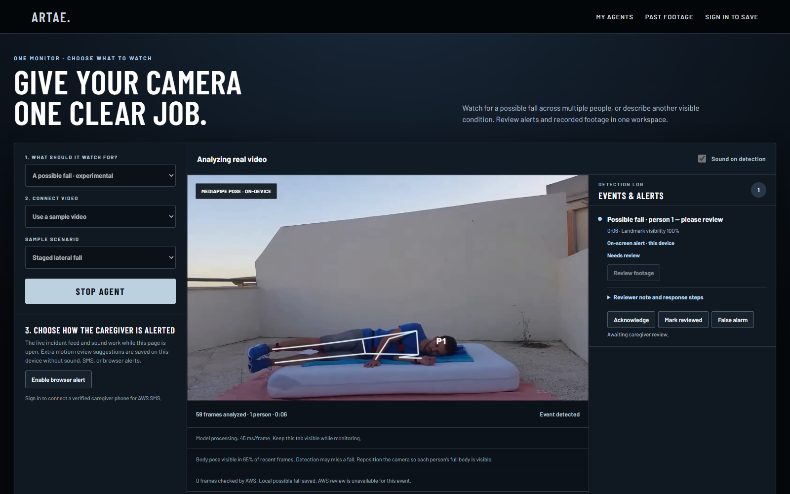
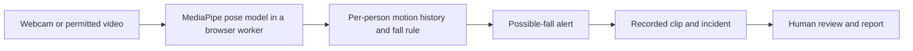

# Artae Vision

**A computer-vision prototype that helps a caregiver review a possible fall.**
Artae analyzes permitted video in the browser, flags a possible fall, keeps a
playable clip, and asks a person to review what happened. The [live demo](https://artae-vision.vercel.app/live)
works with a staged sample without an account or an AWS connection.



*Current `/live` workspace, captured with the cloud API unavailable. The visible
alert came from the browser detector, not a scripted event. The footage is a
licensed staged example.*

**[Try the demo](https://artae-vision.vercel.app/live)** ·
[Watch the workflow video (earlier UI)](https://artae-vision.vercel.app/media/fall-monitor-walkthrough.webm) ·
[Read the engineering case study](docs/portfolio-fall-detection.md)

## Try it in two minutes

1. Open the [live monitor](https://artae-vision.vercel.app/live). Leave **A possible fall** and **Use a sample video** selected.
2. Press **Start agent**. The staged video plays while MediaPipe estimates body poses on your device.
3. When an alert appears, choose **Review footage** to inspect the recorded moment. You can acknowledge it, mark it reviewed, or label it a false alarm.
4. Stop the run and select **Sitting · no fall expected** to see a negative-control clip.

You can also upload a permitted video or use a webcam. The page must stay open
while monitoring. Guest runs and review notes are kept on that device; signing in
adds account-backed agents and history. Audio is not recorded.

## How it works



The fall path runs locally in the browser. It can observe up to four visible
poses and keeps separate motion histories during the session. A pose alone is
not treated as a fall: the rule looks for a change from upright posture through
descent to a sustained ground position. A second pose-window model can add
**unverified review suggestions**; those suggestions do not send caregiver
notifications. Optional Amazon Nova and Strands services can review sampled
frames and coordinate an incident when configured, but local fall detection and
evidence do not depend on them.

| Part | Technology | Role |
| --- | --- | --- |
| Browser app | Next.js, React, TypeScript | Video controls, live incident feed, review, and reports |
| Local vision | MediaPipe Pose Landmarker | Body landmarks in a browser worker |
| Detection | TypeScript temporal rules and per-person tracking | Turns pose history into possible-fall candidates |
| Optional cloud analysis | Amazon Bedrock Nova and Strands | Reviews consented frames and prepares incident actions |
| Saved accounts | Supabase Auth and the FastAPI control plane | Account agents, incidents, and history when configured |

The repository also contains a separate Python camera/edge service using
Ultralytics, ByteTrack, FastAPI, and PostgreSQL. It is an engineering path for
installed cameras; its detector has **not** been validated as a replacement for
the browser demo.

## What the evaluation found

The one-click staged sample proves the *workflow*, not dependable fall detection.
We replayed the browser pipeline on research clips it was not tuned to handle:

| Evaluation | Fall clips alerted | Daily-activity clips alerted |
| --- | ---: | ---: |
| [UR Fall reserved set](docs/urfall-browser-benchmark.md), original live rule | 2/20 | 1/30 |
| [MPFDD shared-frame set](docs/mpfdd-first-look-result.md), current browser paths | 2/22 | 0/6 |

The MPFDD negative clips total only 63 seconds. These small, staged collections
cannot establish a real-world false-alarm rate or safety performance. The poor
fall recall is why Artae is a **research and workflow prototype**, not an
unattended emergency, medical, or caregiver monitoring product. The
[case study](docs/portfolio-fall-detection.md) explains the experiments and
failed model promotions; [per-clip benchmark records](docs/benchmarks) and the
[fall product plan](docs/fall-product-plan.md) show what remains to be tested.

## Run locally

Install Node.js and pnpm, then from this repository:

```bash
cd apps/web
pnpm install
pnpm dev
```

Open **http://localhost:3000/live**. The staged fall demo needs no Supabase
account, Python service, AWS credentials, or webcam. The web app's `predev`
step prepares its pinned browser vision assets from the installed packages.

To check the web code, run these in `apps/web`:

```bash
pnpm typecheck
pnpm lint
pnpm test
```

With the dev server running and Chrome installed, `pnpm test:live` exercises the
fall, sitting, evidence-review, and optional cloud-enrichment flows. It forces
the API to fail for the local-path checks and mocks cloud responses; it does not
make paid AWS calls.

## Find your way around the repo

| Path | What is there |
| --- | --- |
| [`apps/web`](apps/web) | Website, browser detector, review UI, and local evaluation page |
| [`services/inference`](services/inference) | Python camera capture, object/pose models, tracking, and edge rules |
| [`services/api`](services/api) | FastAPI control plane and account-backed incident APIs |
| [`services/alerts`](services/alerts) | Alert delivery and retry worker |
| [`scripts`](scripts) | Demo checks and reproducible evaluation tools |
| [`docs`](docs) | Architecture, benchmarks, failure analyses, and pilot plans |

For the implementation details, see the [architecture](docs/architecture.md),
[browser test scope](docs/browser-demo.md), [file guide](docs/file-guide.md), and
[production runbook](docs/production-runbook.md). Configuration examples are in
[`.env.example`](.env.example) and
[`apps/web/.env.local.example`](apps/web/.env.local.example).

## Next milestone

Improve person observation and tracking in crowded rooms, then freeze a detector
and test it on untouched, labeled multi-person footage with much longer normal
activity exposure. An always-on supervised pilot also needs a reliable camera
host, confirmed alert delivery, approved footage handling, and a real caregiver
review process. The [pilot plan](docs/fall-pilot-plan.md) lists those gates.

The sample footage and research datasets have separate permissions. The
[third-party disclosure](docs/hackathon-disclosures.md) and [license](LICENSE)
cover reuse considerations, including Ultralytics for the separate Python path.
