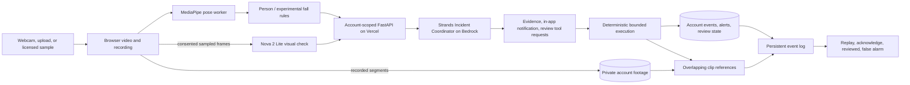

# Agents for Humans architecture

Artae's proposed Professional Agent entry helps users review visual events.
The verified public browser path below does not require a native camera service.
The older installed YOLO/RTSP path is separate and is not a prerequisite for judges.

## Responsibility boundaries

- **MediaPipe and temporal rules** run locally on actual frames. Fall detection
  is experimental, tracks one body, and is not proof of injury or a medical alarm.
- **Nova 2 Lite visual checks** receive at most four sampled frames per request
  for signed-in, consenting users. Results distinguish match, no match,
  uncertainty, and unsupported requests. Missing a brief action remains possible.
- **Strands Agents SDK** receives an incident and selects bounded operational
  tools. Tool requests and usage are stored, not private chain-of-thought.
- **Deterministic execution** saves the in-app alert, links ready overlapping
  account recordings, and maintains the human-review queue. A request to preserve
  evidence is not represented as available footage until a recording is ready.
- **Failures are explicit.** Local candidates can retain a fallback review alert
  when the coordinator fails. A failed custom visual check is not a no-match.
- **Account isolation** applies to jobs, sessions, incidents, and private footage.
  Guest recordings remain local to their browser. Account footage uploads must
  succeed before another device can replay it.

## Deployment and limits

Frontend and FastAPI are deployed to Vercel. Vercel production OIDC assumes an
AWS role restricted to this API project and the Nova 2 Lite inference profile;
there are no permanent AWS access keys in the browser. Supabase supplies account
authentication and the existing private database/storage backend.

The browser must stay open. Guest sessions last at most two minutes; signed-in
sessions offer 2, 15, or 60 minutes and stop at 20 alerts. Recording is segmented
for replay. An hour-long endurance run and broad mobile compatibility are not
yet validated. No SMS, WhatsApp, or telephone delivery is enabled in this flow.

Live positive and negative AWS checks, Strands coordination, saved jobs, footage,
and review persistence were exercised on September 9, 2026. See
[test evidence and limitations](browser-demo.md). This is not unattended
elder-care monitoring or a substitute for an emergency response system.
