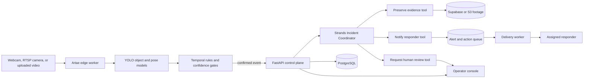
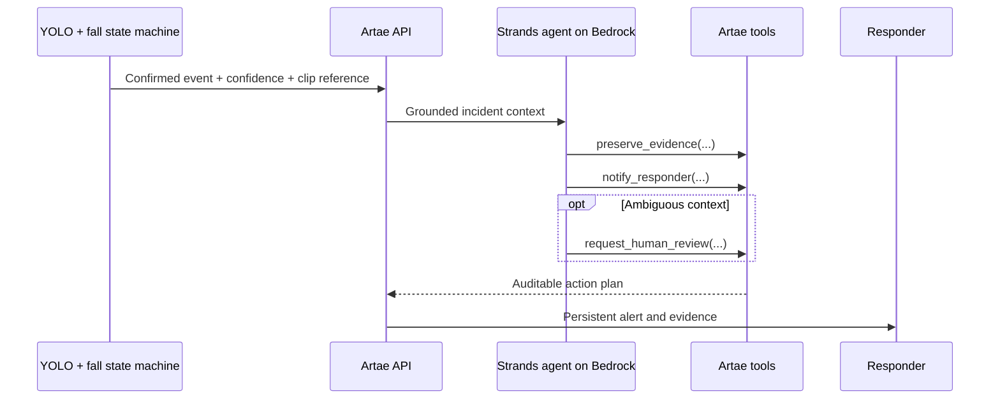

# Agents for Humans architecture

Artae is submitted as a **Professional Agent** for safety and operations teams.
It removes the repetitive work of watching camera walls and surfaces only a
confirmed incident or a decision that needs a person.

## Responsibility boundaries

- **YOLO and temporal rules** process frames continuously. A network model is
  never placed in the real-time frame loop.
- **Strands Agents SDK** receives a compact, confirmed incident and selects the
  appropriate operational tools. Those tool choices control creation of the
  evidence job and responder alert. The tool calls and aggregate usage are stored
  with the event, without storing private chain-of-thought.
- **Safety policy** guarantees that a provider outage or omitted tool call can
  never suppress a confirmed safety alert.
- **The delivery worker** owns retries and delivery status. The model may prepare
  a notification, but it may never claim that a notification was delivered.
- **Humans remain in control** of ambiguous semantic detections and guarded
  external actions.

## Strands tool loop

## Deployment boundary

The web console may remain on Vercel. The control plane and Strands coordinator
can run in Docker for the local demonstration and are designed to move to Amazon
Bedrock AgentCore Runtime. AgentCore is an optional hackathon enhancement; the
required Strands implementation is already part of the API process.
