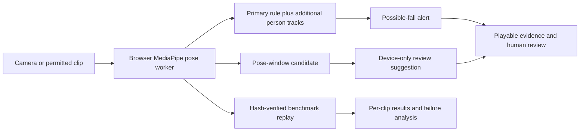

# Artae Vision: fall detection engineering case study

## Project in one minute

Artae Vision is a fall-monitoring research prototype. A browser runs MediaPipe
pose estimation locally, evaluates motion over time, records a playable clip
for a possible fall, and gives a person an incident review and report workflow.
The one-click demo is usable without an account or cloud API. It is not an
unattended safety or medical product.

[Watch the 38-second staged walkthrough](https://artae-vision.vercel.app/media/fall-monitor-walkthrough.webm)
or [open the working demo](https://artae-vision.vercel.app/live). The recording
shows local detection, evidence review, and a sitting negative control with
cloud API calls disabled.

I built a reproducible evaluation path because three successful demo falls
could not answer whether the detector would work on other people and camera
angles. Preparation scripts obtain permitted research footage locally, pin
source revisions and media SHA-256 values, and run the same browser pose worker
and fall rule used by the demo. The reports preserve code/model hashes, per-clip
detections, pose coverage, and timing without publishing participant footage.

## Architecture

The trained pose-window candidate uses 11 causal features from one second of
pose history, including normalized body position, torso angle, box shape,
recent changes, and pose coverage. It requires observed motion and two
consecutive positive samples, and clears stale history after tracking loss.
The Python trainer and TypeScript runtime agreed on all 80 development clips.
The frozen v1 candidate now creates **device-only, unverified review
suggestions**. These do not send sound, browser, or caregiver notifications.
Only the conservative temporal rule can create a possible-fall alert.
The current browser path keeps that rule for the primary pose and runs
independent temporal rules on additional session-only person tracks.

## Measured result

The [UR Fall set](urfall-browser-benchmark.md) exposed a generalization gap:
the live rule detected only 2/20 reserved falls with 1/30 activity clips
alerted. We then used a separate [GMDCSA-24 set](gmdcsa24-browser-validation.md)
with a person split. Subjects 1–2 were development; subjects 3–4 were reserved
until code and threshold were frozen.

| GMDCSA-24 subjects 3–4 | Fall clips detected | Activity clips alerted |
| --- | ---: | ---: |
| Live temporal rule | 17/38 | 1/42 |
| Trained pose-window candidate | **24/38** | **2/42** |
| Static posture ablation | 28/38 | 10/42 |

The candidate gained seven fall detections. Mean delay among its detected
falls was 0.73 seconds versus 1.73 seconds for the live rule; these means
include different detected clips. It also added one activity alert and missed 14 falls.
The false alerts involved exercising; 10 missed fall descriptions mention a
bed. We did not replace the live rule. Each dataset contains staged activities
by healthy volunteers. Clip classification on a few minutes of negative video
does not establish real-world fall recall, alert workload, or safety.
The [failure audit](fall-failure-audit.md) records the bed-fall slice and the
next independent test gate.

A later [five-source audit](fall-cross-source-v4.md) includes 525 staged fall
and daily-activity clips. The temporal rule found 1/35 staged falls in one
new source. The review-only candidate found 27/35 there but only 11/100 in a
different, correlated-source fall set. A multi-source training experiment
improved some development folds but fell to 3/50 CAUCAFall clips when that
source was held out at a zero-activity-alert setting. We rejected that model.
The negative footage across four sources totals only about 0.49 hours, so
these numbers do not establish a field false-alert rate.

The [committed UR result](benchmarks/urfall-browser-v2.json) and
[subject-separated GMDCSA result](benchmarks/gmdcsa24-subject-holdout-v1.json)
make the comparison auditable. Research media stays local and ignored by Git.

I then froze a second candidate before a new [CAUCAFall cross-source test](caucafall-independent-result.md):
all 100 videos were hash-verified and replayed through the same browser worker.
The live rule caught 17/50 staged falls, the first pose-window model 4/50,
and the expanded-training model only 3/50; none alerted on the 50 short
daily-activity clips. This negative result kept both candidates out of the
live alert path and exposed the need for stronger cross-scene generalization.

A later [multi-person regression](caucafall-multiperson-regression.md) on those
same 100 clips found 20/50 staged falls, up from 17/50, while introducing one
activity alert. The intermediate four-pose-only path had found just 8/50;
retaining a separate one-pose primary path prevented that regression. Because
these are already examined, single-person clips, the numbers are development
evidence rather than independent multi-person accuracy. A side-by-side video
smoke test checks fall alerts with another person visible on either side.

## Engineering choices I can explain in an interview

- **Avoiding demo overclaim:** a 3/3 staged-fall smoke test triggered an
  external benchmark and exposed 2/20 recall on unseen UR clips.
- **Fair comparison:** the temporal rule, posture ablation, and trained model
  consume the same pose estimates for each sampled frame.
- **Leakage control:** trained with already examined UR clips and GMDCSA
  subject 1; tuned with subject 2; froze code and threshold before one run on
  subjects 3–4. Those subjects are no longer a fresh holdout.
- **Runtime parity:** tested Python training replay against the TypeScript
  inference rule across every development clip and repeated subject-2 scoring
  in the real browser pipeline.
- **Multi-person regression control:** froze and replayed the browser pipeline,
  found that four-pose tracking alone reduced event recall, then preserved the
  primary rule while adding separately tracked people. Recorded the added
  false alert and runtime cost alongside the detection gain.
- **Operational honesty:** a browser tab is not an always-on camera service;
  the [pilot plan](fall-product-plan.md) calls for an independently tested edge
  path, evidence delivery, receipt, and a consented shadow pilot.

## Resume bullet

> Built an on-device fall-monitoring prototype with MediaPipe, TypeScript,
> and Next.js, including evidence capture and human review; benchmarked 525
> staged fall and daily-activity clips across five research sources, exposing
> cross-scene failures and separating automatic alerts from unverified review suggestions.

This bullet describes engineering work and evaluation scope. It does not claim
that the system is reliable for unattended monitoring.
