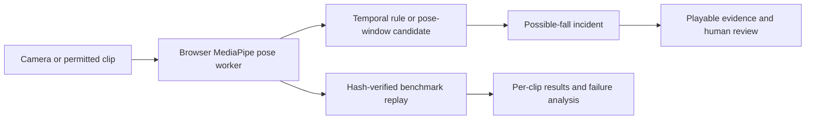

# Artae Vision: fall detection engineering case study

## Project in one minute

Artae Vision is a fall-monitoring research prototype. A browser runs MediaPipe
pose estimation locally, evaluates motion over time, records a playable clip
for a possible fall, and gives a person an incident review and report workflow.
The one-click demo is usable without an account or cloud API. It is not an
unattended safety or medical product.

[Watch the 38-second staged walkthrough](https://artae-vision.vercel.app/media/fall-monitor-walkthrough.webm)
or [open the working demo](https://artae-vision.vercel.app/live). The recording
shows local detection, evidence review, and a sitting negative control with
cloud API calls disabled.

I built a reproducible evaluation path because three successful demo falls
could not answer whether the detector would work on other people and camera
angles. Preparation scripts download licensed research footage locally, pin
source revisions and media SHA-256 values, and run the same browser pose worker
and fall rule used by the demo. The reports preserve code/model hashes, per-clip
detections, pose coverage, and timing without publishing participant footage.

## Architecture

The trained pose-window candidate uses 11 causal features from one second of
pose history, including normalized body position, torso angle, box shape,
recent changes, and pose coverage. It requires observed motion and two
consecutive positive samples, and clears stale history after tracking loss.
The Python trainer and TypeScript runtime agreed on all 80 development clips.
The candidate is evaluated alongside the live rule and is **not** creating
live incidents.

## Measured result

The [UR Fall set](urfall-browser-benchmark.md) exposed a generalization gap:
the live rule detected only 2/20 reserved falls with 1/30 activity clips
alerted. We then used a separate [GMDCSA-24 set](gmdcsa24-browser-validation.md)
with a person split. Subjects 1–2 were development; subjects 3–4 were reserved
until code and threshold were frozen.

| GMDCSA-24 subjects 3–4 | Fall clips detected | Activity clips alerted |
| --- | ---: | ---: |
| Live temporal rule | 17/38 | 1/42 |
| Trained pose-window candidate | **24/38** | **2/42** |
| Static posture ablation | 28/38 | 10/42 |

The candidate gained seven fall detections. Mean delay among its detected
falls was 0.73 seconds versus 1.73 seconds for the live rule; these means
include different detected clips. It also added one activity alert and missed 14 falls.
The false alerts involved exercising; 10 missed fall descriptions mention a
bed. We did not replace the live rule. Each dataset contains staged activities
by healthy volunteers. Clip classification on a few minutes of negative video
does not establish real-world fall recall, alert workload, or safety.
The [failure audit](fall-failure-audit.md) records the bed-fall slice and the
next independent test gate.

The [committed UR result](benchmarks/urfall-browser-v2.json) and
[subject-separated GMDCSA result](benchmarks/gmdcsa24-subject-holdout-v1.json)
make the comparison auditable. Research media stays local and ignored by Git.

## Engineering choices I can explain in an interview

- **Avoiding demo overclaim:** a 3/3 staged-fall smoke test triggered an
  external benchmark and exposed 2/20 recall on unseen UR clips.
- **Fair comparison:** the temporal rule, posture ablation, and trained model
  consume the same pose estimates for each sampled frame.
- **Leakage control:** trained with already examined UR clips and GMDCSA
  subject 1; tuned with subject 2; froze code and threshold before one run on
  subjects 3–4. Those subjects are no longer a fresh holdout.
- **Runtime parity:** tested Python training replay against the TypeScript
  inference rule across every development clip and repeated subject-2 scoring
  in the real browser pipeline.
- **Operational honesty:** a browser tab is not an always-on camera service;
  the [pilot plan](fall-product-plan.md) calls for an independently tested edge
  path, evidence delivery, receipt, and a consented shadow pilot.

## Resume bullet

> Built an on-device fall-detection prototype with MediaPipe, TypeScript, and
> Next.js, including evidence capture and human review; automated a
> hash-verified 230-clip benchmark across two research datasets with a
> person-separated holdout and compared three pose-based detection methods.

This bullet describes engineering work and evaluation scope. It does not claim
that the system is reliable for unattended monitoring.
